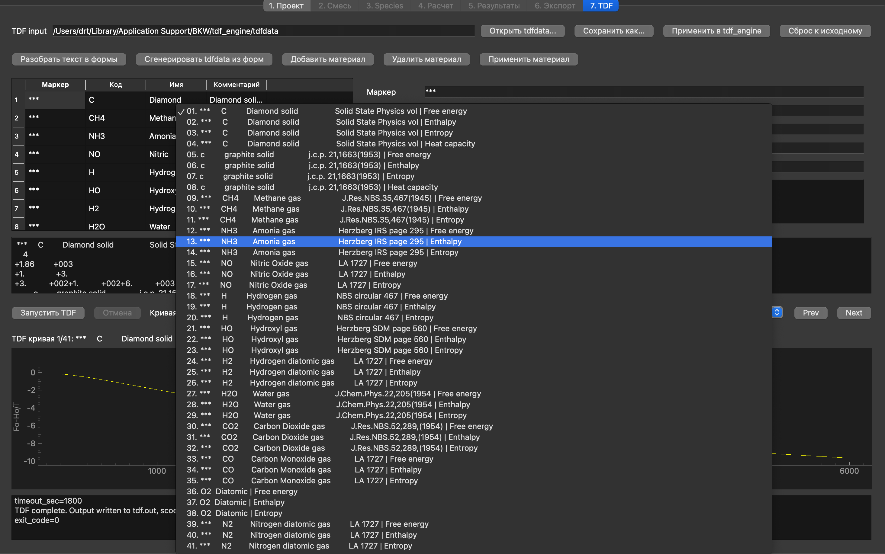

# BKW

Thermochemical toolkit covering detonation parameters (Becker–Kistiakowsky–Wilson), specific impulse, and thermodynamic functions of ideal gases and solids.



## What it does

- **BKW** – detonation parameters from a `BKWDATA` deck, producing the classical `bkw.out` report (Hugoniot, isentrope, CJ point).
- **ISPBKW** – specific impulse calculations for ISP-mode decks (`ioeq=2`), producing `isp.out`.
- **USERBKW** – `BKWDATA` preprocessor: pick a chemistry template (CHNO, CHNF, ...), define the mixture, add custom species, tweak legacy USERBKW knobs.
- **TDF** – thermodynamic functions of ideal gases and solids: input deck editor, in-process solver, curve viewer.
- **Desktop UI** – single window covering the whole workflow: project setup → mixture → species → calculation → results / graphs / CSV / PNG export, plus a separate TDF tab.

## Components

| Component | Docs |
|---|---|
| Python calculation package (`bkw`, `ispbkw`, `userbkw`, `tdf` CLIs) | [`bkw_py/README.md`](./bkw_py/README.md) ([RU](./bkw_py/README_RU.md)) |
| Desktop application (PySide6 + pyqtgraph, Nuitka builds) | [`bkw_ui/README.md`](./bkw_ui/README.md) ([RU](./bkw_ui/README_RU.md)) |

## Origins and attribution

This project is an independent Python port of the BKW-family programs distributed with Charles L. Mader's *Numerical Modeling of Explosives and Propellants*, Third Edition (CRC Press / Taylor & Francis, 2008). The publisher's page describes the book resources as including FORTRAN and executable computer codes for Windows and OS X, and the CD-ROM contents list includes the `BKW`, `USERBKW`, `TDF`, and `ISPBKW` programs together with supporting data files such as `ZZZTHERC`, `ZZZCOMPS`, and `TDFFILES`.

- Routledge book page: [Numerical Modeling of Explosives and Propellants, 3rd Edition](https://www.routledge.com/Numerical-Modeling-of-Explosives-and-Propellants/Mader/p/book/9781420052381)
- Original FORTRAN BKW report (LANL, 1967): [Mader, "FORTRAN BKW: A Code for Computing the Detonation Properties of Explosives", OSTI 4307185](https://www.osti.gov/biblio/4307185) (DOI [10.2172/4307185](https://doi.org/10.2172/4307185))

## Quick start

Install from the repository root:

```bash
pip install -e .
```

Or with `uv`:

```bash
uv sync
```

Launch the desktop UI:

```bash
bkw-ui
```

With `uv`, use:

```bash
uv run bkw-ui
```

Or the CLIs:

```bash
python -m bkw_py.userbkw --template CHNO --mix "rdx=60,tnt=40" --output BKWDATA
python -m bkw_py.bkw --input BKWDATA --output bkw.out
```

See the per-component READMEs for full reference.

## Building a packaged application

Standalone / onefile builds via Nuitka:

```bash
./scripts/package-macos.sh
pwsh ./scripts/package-windows.ps1 -Mode onefile -Lto yes
./scripts/package-linux.sh
```

Artifacts land in `dist/`. The build args already pull in `pyqtgraph`, `numpy`, `PySide6.QtOpenGL`, and `PySide6.QtOpenGLWidgets`, so graphs work out of the box.

## Requirements

- Python 3.11+ (packaging scripts default to 3.14)
- `PySide6 >= 6.7`, `pyqtgraph >= 0.13`, `matplotlib >= 3.10`

## License

MIT – see [LICENSE](./LICENSE).
